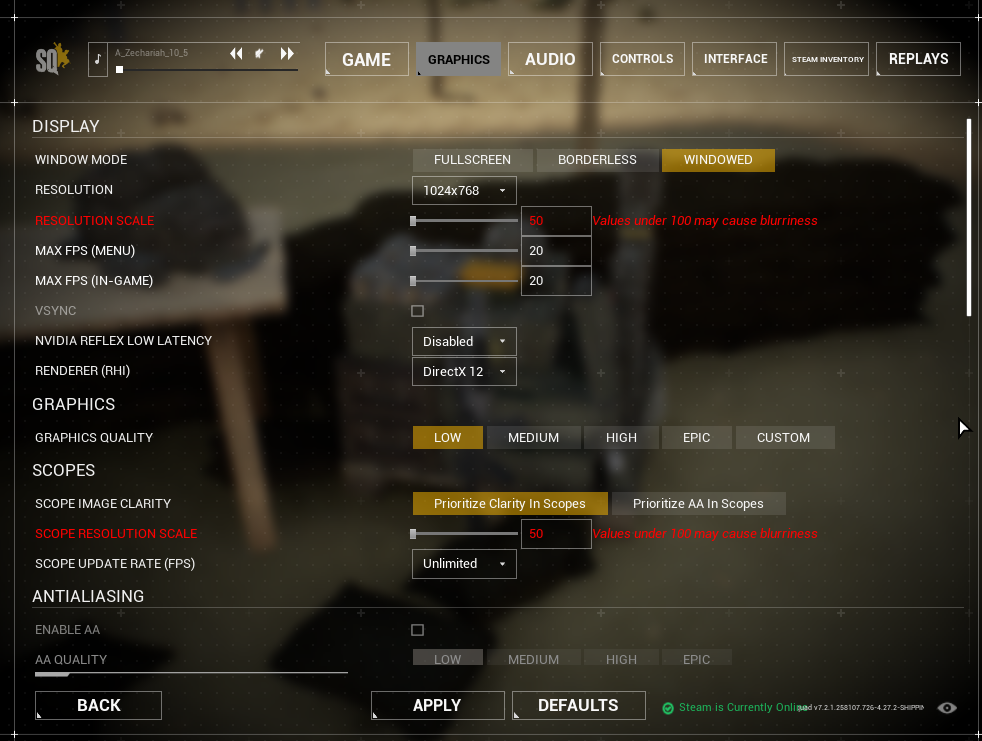
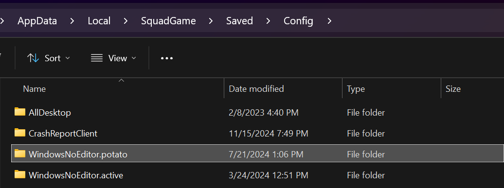
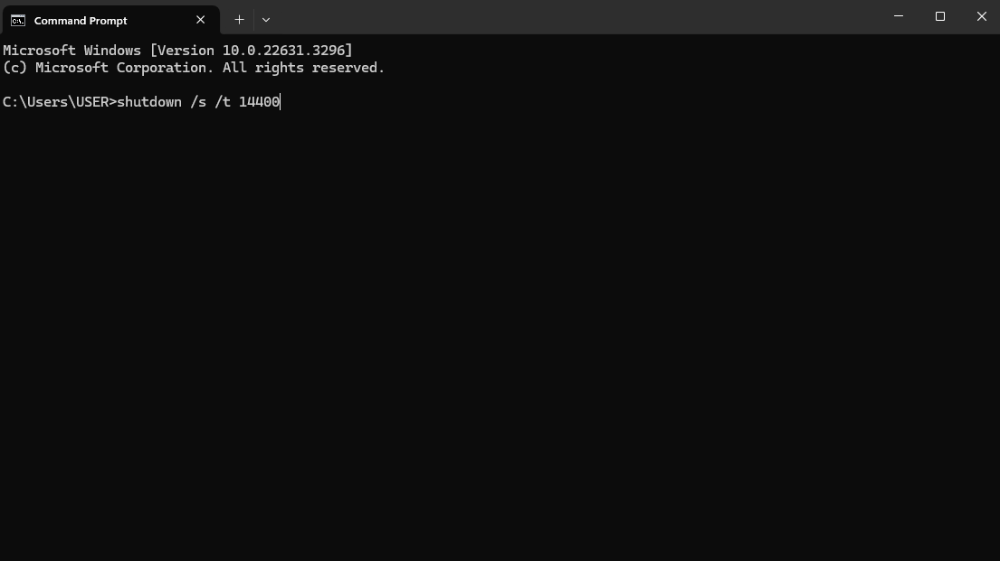
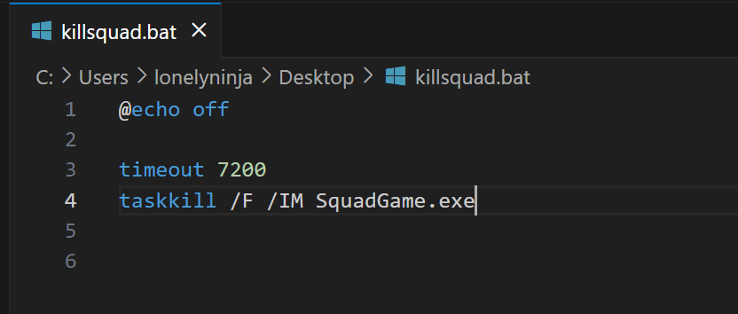

# TT Seeding Guidelines

The purpose of this document is to help get people on to get the TT server active early.


# AFK Seeding

The key to a viable server is timely seeding. To ensure this, we ask for your help! The easiest way to help the server is the following:

Set game to “potato mode” (explained below)


Set an auto shutdown timer (explained below)


Join the server between the hours of 7AM-12PM Eastern (depending on your work/study routine) and AFK.


That’s it! Your PC will auto shutdown at the requisite time, and you can come home to a full server at minimal effort!

## Potato mode

Putting the game in an extreme low setting mode reduces power and memory consumption to negligible amounts. For example, with squad running in “potato mode,” I can play heavily demanding games such as Red Dead Redemption 2 simultaneously at perfect FPS on a fairly non-remarkable PC!

Potato mode settings:

* Resolution 1024 * 768, in “Windowed” mode
* Resolution scale = 50
* Max FPS (Game & Menu) = 20
* Graphics Quality = Low
* Scope Resolution scale = 50 (this one doesn’t matter for AFK seeding really)
* Anti-Aliasing OFF 
* Upscaling OFF
* All settings from Textures to Post Processing at the lowest possible setting.
* Everything remotely fancy turned off (Wake simulation, Lens Flares, etc)

It looks something like this:


While Squad is running in this mode, AFK seeding consumes minimal resources!

## One-time Setup after Making Changes

Once you have made these changes, you can save them so that you don’t have to do this every time. Open %LOCALAPPDATA%\SquadGame\Saved\Config and copy your WindowsNoEditor directory to WindowsNoEditor.potato.  For your active game settings, you can do the same and name it WindowsNoEditor.active.  When you want to  AFK seed, rename the WindowsNoEditor.potato (the potato config) directory to WindowsNoEditor. When you want to play, rename the WindowsNoEditor.active (the good config) directory to WindowsNoEditor.  Easy-peasy!



##  Auto-shutdown

You should set your PC to auto shutdown at some time around 3PM EST, give or take 30 minutes. The way to do this easily is to open up command prompt and type the following command:



```
C:\Users\USER> shutdown /s /t [Insert number in seconds]
```
For example, if I wanted my PC to shutdown in 4 hours, I would type: `shutdown /s /t 14400` where 14,400 seconds is the amount of seconds in 4 hours:

The more that people can do this, the better off the server will be!

## Auto-Kill

If you don’t want to shutdown your computer, you can create a batch file to kill Squad after some period of time.  Change 7200 to however many seconds you want to wait before killing it.  Double-click file, win!


