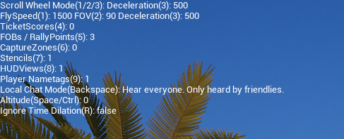

# Admin Cam

!!! note
    Remember, only one admin per team should be in admin cam at any time

Press `Shift + P` to enter admin cam

A variety of settings can be adjusted in admin cam.  Press `0` to bring up the menu, which looks like this:

Suggested things you may want to change immediately:

* Deceleration - How quickly you decelerate after releasing a movement key
* FlySpeed
* Local Chat Mode - let's you here only your team or everybody
