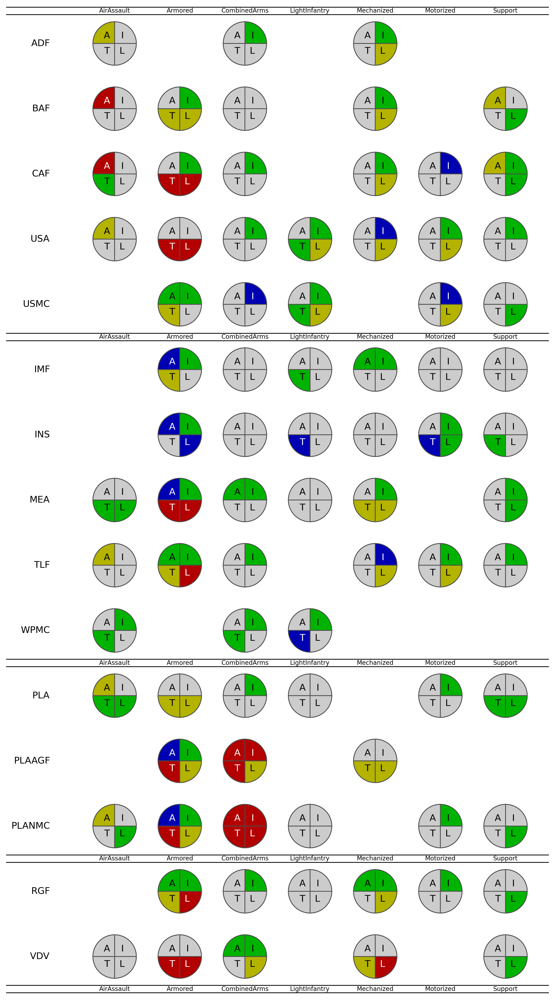

# Factions

```
Note from LonelyNinja: Capture conventional player/admin wisdom on factions
```
* BLUFOR
    * ADF
    * BAF
    * CAF
    * USA
    * USMC
* PAC
    * PLA
    * PLAAGF
    * PLANMC
* REDFOR
    * RAF
    * RGF
* Independent
    * MEA
    * TLF
    * Insurgents
    * IMF
    * WPMC

# Sub-Factions/Units

|	Type|	Description|
|------|--------------|
|Air Assault|Air mobility and light vehicles, no heavy vehicles, extra ATGM (TOW) per FOB|
|Armored|Heavy armor (tanks), minimal supporting vehicles and helicopters|
|Combined Arms|General default setup|
|Light Infantry|Specialized ATGM vehicles or extra ATGM per FOB, but lack heavier vehicles like APCs, IFVs, and MBTs.|
|Tracked/Mechanized|Tracked APCs and IFVs (or wheeled IFVs depending on the faction).  Lower speeds, higher protection and firepower|
|Wheeled/Motorized|Motorized units specialize in speed over armor and protection, making use of wheeled vehicles and IFVs.|
|Support|Logistics, FOBs, intelligence, and mobile artillery. Extra HAB and ATGM per radio. Can see the enemy's vehicle spawn timers.|
|Amphibious Assault|Amphibious vehicles and amphibious assaults.|

---
---
---

In the below image, the color key is:
* BLUE=top 15%
* GREEN=top 30%
* YELLOW=bottom 3
* RED=bottom 15%

The text key is
* A = Armor
* T = Transportation
* L = Logistics
* I = Infantry



Some general things to note about this:

* PLANMC and PLAAGF CombinedArms are weak
* PLA Support, CAF Support, IMF Motorized are comparatively strong 

