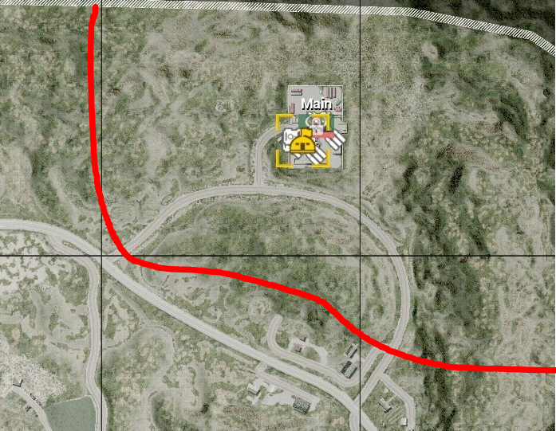
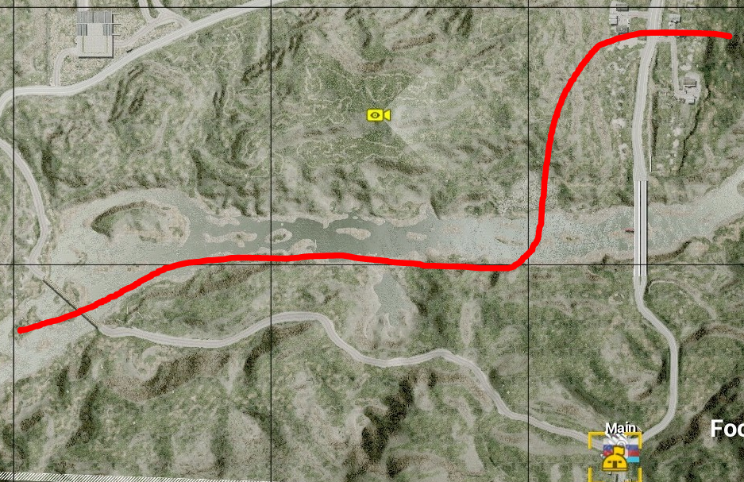
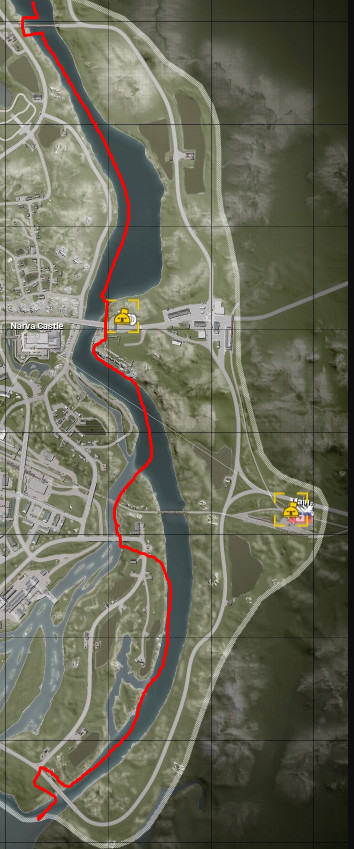
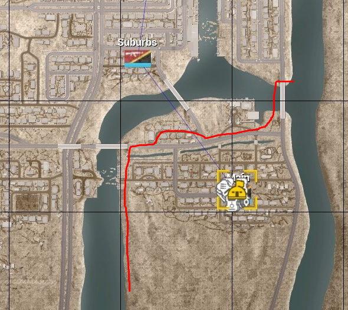

# Guidelines for Enforcement

> "The two pillars of enforcement at TT are clarity and professionalism."
>
> -- Chrisweb, 2020 

## General Enforcement

Players judge the team by its interactions with the community. We want to cultivate a reputation as fair rule enforcers, and avoid a reputation as selective enforcers, pushovers, or sticklers. The primary goal of enforcement is compliance, here are some tips we’ve found best achieve compliance: 

Ensure a player has received a warning and allow them time to comply.  Communicate game play violations and remedies before escalation. 

Investigate and escalate appropriately. We have lots of options to communicate with players.  Global broadcast callouts, multiple warnings, team chat, direct comms, or the testimony of a regular close to an issue are ways to make certain a message is sent and received.

Do not drive yourself insane with minor rule enforcement during gremlin hours. During server "off hours" (10am-2pm; 1am-6am), or when an admin is the sole admin online, enforcement can be focused on egregious rule violations and OWI's Code of Conduct. 

Open a dialogue. Pre-made warning “shortcuts” are effective tools, but lack a human touch. If you cannot open a dialogue through text or voice, is there another admin in their squad or command net that can? 

Create and read BattleMetrics (BM) player notes. Was a player warned for the same thing a week ago, or is the player a first timer with 8 hours in the game? Keep yourself and other admins informed through BM notes, BM player flags, and the #problem-players channel.

Test your thinking, ask another admin. See what other people think in game or in #admin-barracks.

Thank a player for their cooperation. A short message that lets a player know we appreciate their cooperation helps to build trust in the admin team. 

## Kick and Bans

Admin messages must be terse, descriptive, and to the point. At no point should a kick, ban, or warning message be unprofessional, sarcastic, or hostile. 

Reasonable ban lengths can be found pinned in #problem-players and in the Admin Reference Sheet. Ban lengths can be extended by providing a summary, BM link, and evidence in #problem-players. 

Removals should be due to a clear violation of the rules, not the fact a player didn’t follow an admin order. Honest errors due to imperfect information, bad reports, or a lapse in judgment are an expected part of the service. We learn from these mistakes and minimize them in the future.

|Acceptable kick messages|Unacceptable kick messages|
|------------------------|--------------------------|
|Intentional Teamkilling | GROW UP MORON |
|Basecamping | I TOLD YOU TO BACK OFF |
|Harassment/Trolling | FUCK OFF|
|Spamming/Comm Spam| CLEAR ALL CHAT DUMMY!|

# Specific Enforcement 
## Team Killing

Admins are not required to track down every team kill (TK) that occurs. A single, unreported team kill is not a basis for action. 

Reported or recurring team kills should be investigated. Use other admins, testimony from trusted regulars, video evidence, and server logs as a source of information. 

Without a reliable witness, err on the side of caution. Request players post evidence in Discord. Evidence allows us to issue bans for actions we did not witness after the fact.

Retaliatory TKs are unacceptable. Encourage the use of the !report function. However, do not punish players that end an ongoing mass TK.

Reasonable ban length for a first offense, intentional TK is 1-2 days. Repeat offenders and egregious offenses may deserve weeks, months, or a permanent ban.

## Kit Enforcement 

Ensure every SL has a proper SL kit at round start. We do not want to punish an entire team. The earlier you can fix kits, the better. 

Players should be warned 1-2 times to acquire an SL kit. Dialogue through local chat or command net is a good way to know you’ve been heard. 

Global broadcasts with a time limit work well for mid-round problems. E.g., `Squad 9 RUS needs an SL with an Infantry SL kit by 1:38 or their squad will be disbanded.`

SLs are allowed to temporarily drop their kits to complete specific tasks. They may repair a vehicle, dig a HAB up, or even grab a LAT kit to shoot an APC. 

Disbands are not desirable. If an SL acknowledges he is working on a kit, then give him time to sort it out. If an SL respawns repeatedly with no response to a warning, then it may be time to remove them.
Solo Vehicles

Catch solo vehicles in main or close to main. We want to avoid asset waste and abandoned vehicles. 

Give a solo vehicle a chance to return to base. Acknowledgment of a warning or a 180 turn back to main indicates a warning has been heeded.

Work with crewmen that become solo due to a disconnect. They are not required to cut from an active engagement, but they cannot fly solo forever.

Do not punish players that recover abandoned vehicles. It is acceptable for a player to grab a crewman at their rally after they recover a vehicle. This exception applies to players who retrieve a crewman that died while repairing.

## All Chat

The goal of the all chat rule is to keep the server focused on the game. Don’t go crazy to prevent every message. Some good natured light banter among friends and game discussion is allowed.

We do not want controversial opinions, provocative bait, or pet topics in text or voice chat. Examples include policy, politics, religion, culture war, and excessive smack talk. 

Broadcast or send a direct warning to clear all chat before removal.

Do not immediately remove players that question admin action. Ask that players take substantial criticism of admin action to Discord. 

We expect admins to ignore small time snark and prevent flame wars.

## Teamwork, Communication, and Game Play

Communication (“comms”) check. Silent SLs should be warned through global command net, direct comms, and chat messages. Confirm an SL is not on the phone before removal.

Admins are not the game play police or meta enforcers. Personal disagreements on tactical decisions are inevitable and allowed. If a player makes an effort to communicate, cooperate, and coordinate teamplay they are not in violation of teamwork rules. 

Bad faith or malicious players rarely hide. Players allergic to teamwork will say things like,  “No, I don’t care the flags go West, fuck you. I’m doing what I want. I don’t give a shit.” 

Document more ambiguous teamwork violations in `#problem-players`, add a BM note, and share video clips so admins can make an informed judgment of the player. 

## Team Balance

Balance is complex and always changing. The main elements that dictate a team’s performance are squad leaders (SLs), shooters, armor, and pilots. 

To identify and address balance, consider these game elements as indicators and tools:
Tickets. Ticket differential is a major element in perceived and real balance issues. We are required to employ balance actions after two consecutive 200+ losses. 

Kill:Death (KD) differential. Large KD differentials can indicate a skill disparity, especially when supported by other elements.

Squad leaders. Regular and clan SLs are more likely to put in effort to coordinate and play to win– the basic requirements necessary for competitive games. 

Organized groups. Shooter squads, radio hunters, and 9-man clan squads vary in amount of impact, but tend to have more impact than random open squads.

Armor and pilots. An abundance of experienced armor players versus a team with inexperienced or no armor players can account for 40-100 tickets. A team without a serviceable helo pilot is at a distinct disadvantage.

Map/Layer. Consider that some layers are less forgiving than others.

Keep groups together when switching players. Before you !switchnext a player, confirm you do not need to send other players with them. Splitting community groups should be minimized. 

Start small to avoid over balancing and counter rolls. 1-2 carry SLs or a small squad of skilled shooters can change a balance dynamic. 

The nuclear option: randomization is not a reliable way to balance. The !randomizenext command exists as a failsafe to demonstrate admins are trying. There is almost always a better alternative.

## More Balance Tips

Balance requires current, honest information. Honest people can still be wrong, but an ego free analysis of a team’s performance leads to the best balancing decisions. 

On a losing team, an honest admin may see that their team lost on rollout, a poor HAB placement, and not due to skill disparity.

On a winning team, an honest admin might ask if the other team needs help after a game was too easy given their team’s performance.

Squad leaders have the more complete view of team performance. A medic or vehicle gunner may lack critical information to accurately judge team performance.

Balance through map selection does not address team problems. Stacking the deck through map selection can make for good games if the skill disparity is not too great. However, a broken team is still broken on an advantageous layer.

Recent game history is necessary for informed judgments. A skilled group that was online the previous map may have disconnected or ongoing balance actions may need time to be judged.

Perception is important. Players judge, sometimes poorly, names on a scoreboard. Blow outs rapidly bring attention to which side has the most tags and regulars.
Communicate when you or your group will be leaving. This helps admins anticipate impact on team balance.

## Base Camping

Base camping rules allow a losing team a chance at a comeback in the mid game. The rules are designed to make sure a team does not get trapped inside main base protection (MBP) or have to dedicate huge resources to clearing the route from main.

Don’t immediately jump to intent. Violations of the rules of thumb cover the majority of base camping situations. The rules of thumb:

* First Flag and Main: If a squad, player, or asset is loitering behind the enemy’s team first flag, and 450m (FOB radius) distance: Engaging enemy assets within the 450m radius circle.
* Timing is important. Loitering is a sin. A poorly placed mortar FOB does not give carte blanche to sit outside a team’s main for the rest of the game. A Chora game that ends with a team running from main to their first flag is probably long over.
* No free lunch. No one-way safety zones. Assets should not position themselves outside MBP, then cry foul when they are engaged. 

Most base camping scenarios are solved by a simple warning to move. Repeat offenders should be noted and discussed in `#problem-players`.

You can find past BCC rulings in an `#admin-barracks` thread. 

## Base Camping Conflict Resolution & the BCC: 

Admin disagreement about base camping should move to `#base-camping` in Discord.  If an agreement cannot be reached by in-game admins, the stricter assessment of the situation by an HQ member will stand in the moment.

Please take Admin Cam screenshots of disputed situations. 

The Base Camping Committee (BCC) will read, oversee, and participate in `#base-camping`. Admins that disagree with calls and interpretations will start a constructive discussion on that situation. Other admins may contribute their informed opinions and considerations.

The BCC, made up of 3 members of HQ, and overseen by Kirb will assess the situation. Internally, the BCC will vote on it and render a decision. This decision will be a majority decision by the committee with Kirb able to overrule it. The ruling will come with an explanation of the situation and how it may apply in the future. This decision will become the standard and overrule individual opinions of admins. If HQ disagrees with this interpretation of the rules and situation, they can overrule the decision through a majority vote.

Grandfathered “No Go” Zones (Fools Road, Narva, Basra)

