!!! note
    From LonelyNinja: This is a placeholder for the documentation )0_Zero_0_ is writing.

# Introduction

Most of the time, you will interact with the front page, the `Queue`.

If you're a watcher instead of a reader, check out [_0_ZERO_0_'s tutorial video](https://www.youtube.com/watch?v=nWEJDco3STI)

# Queue Page 

## Now Playing

Hitting `View Match History` will take you to [My Squad Stats](https://mysquadstats.com/servers/719480#matchHistory).  Sort by Start/End time to see the most updated maps.  

* Green is the previous faction
* Yellow is the ticket count
* Blue is the map

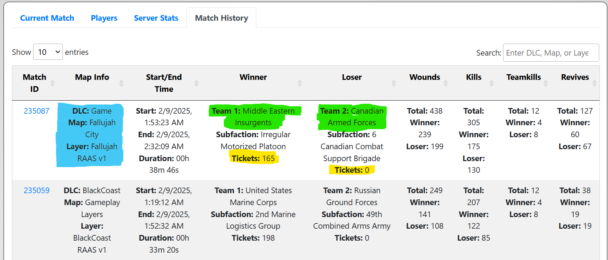

!!! warning
    You must manually refresh this page to update the played layers

## Up Next

* `Play After` will insert something at the end of the queue
* `Play Next` will insert something at the front of the queue

# Add to Queue

When you press `Play Next` or `Play After`, you will be greeted with this:

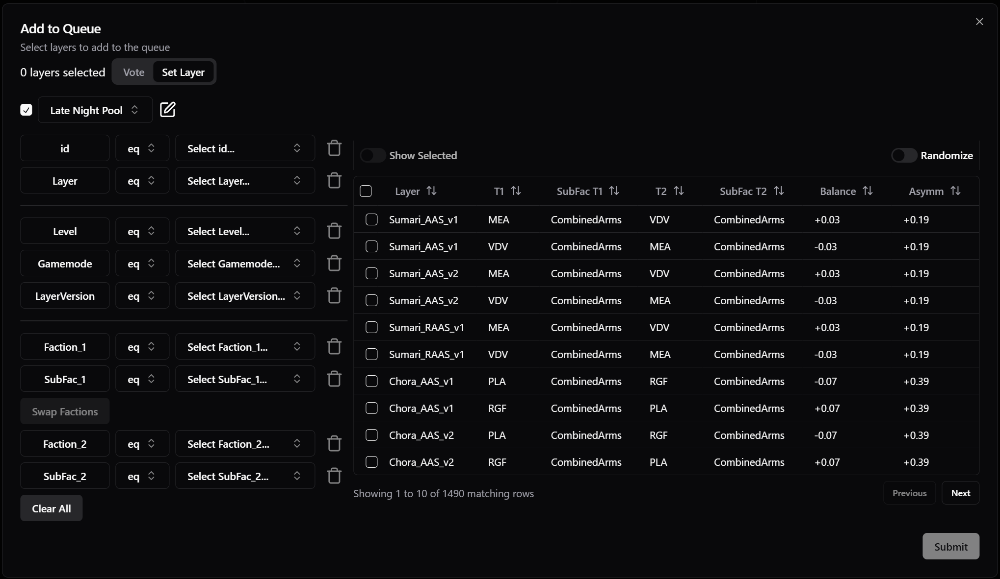

## Set or Vote
At the top, you'll see a toggle.  Switching this will change between adding a single or multiple maps to the queue or creating a single vote with multiple selections.

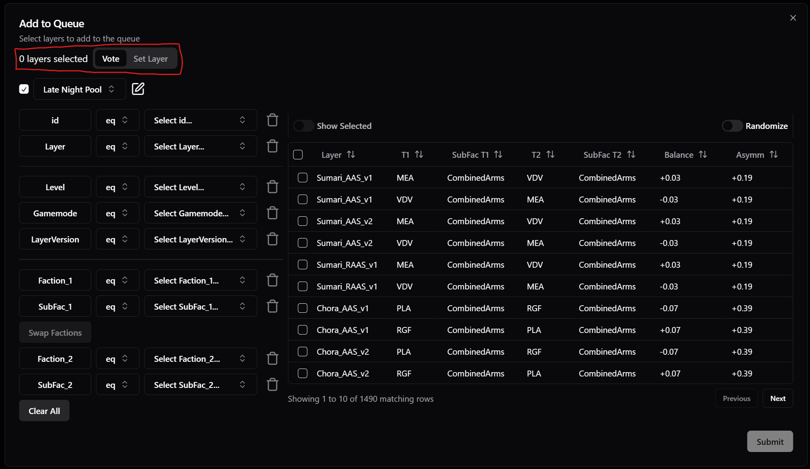

Each of the drop-downs lets you select filters specific to the selected category.

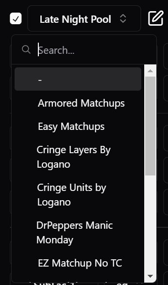

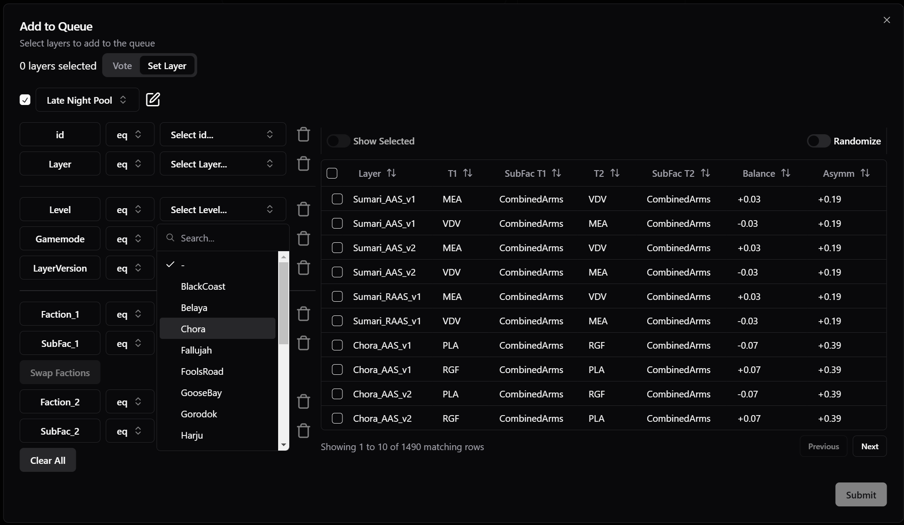

!!! important 
    Remember to hit `Save Changes`!
    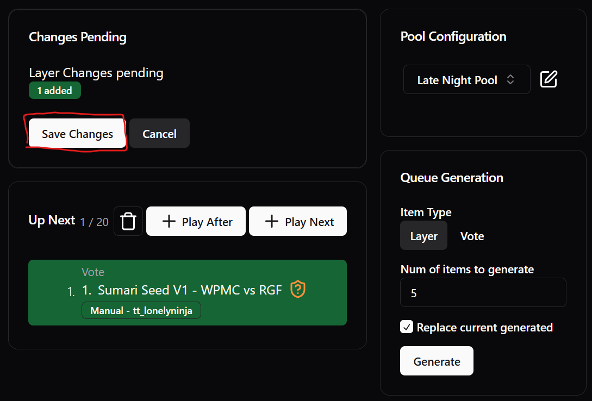

# Quick Edit

You can edit individual matches in the queue. When you hover your mouse over a round, you'll see a menu button appear

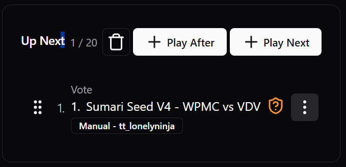

Clicking that will give you options for that match:

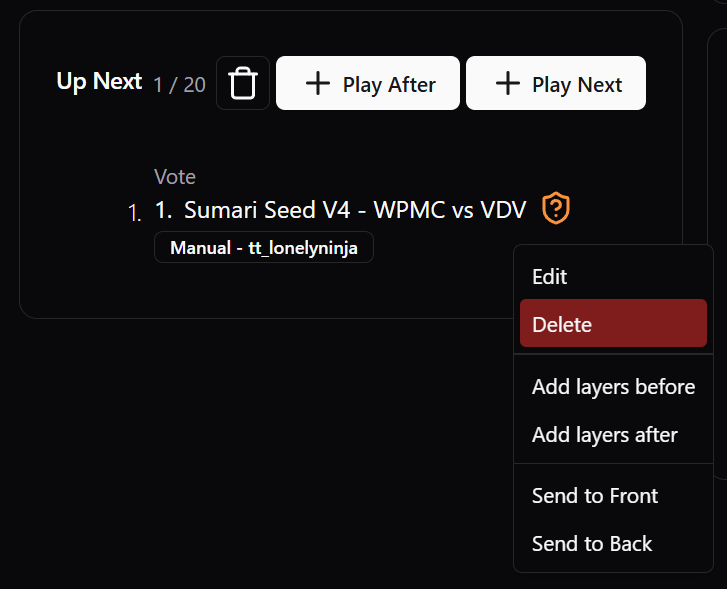

Most of the time, you will want to either edit or delete that entry.  Importantly, hitting edit here is where you can swap factions.

## Faction Swap { #faction-swap }

One important note is that editing a layer is where you can swap factions.

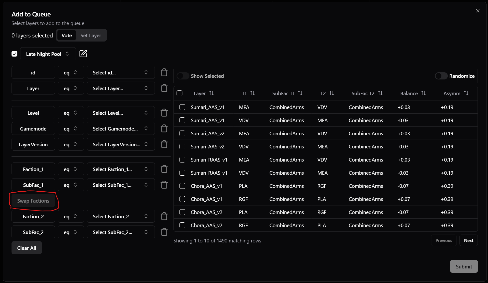

## Queue Generation

You can use queue generation if you don't want to think too hard. This will generate layers based on the existing selected map pool filter.

Generate a vote, which will add however many you want to the vote.

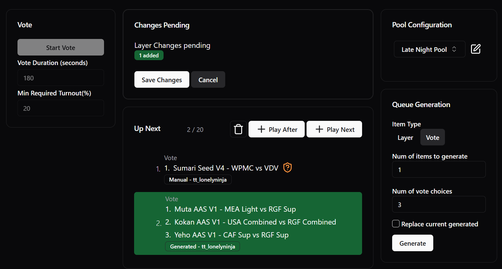

Or just generate a set of layers to add to the queue

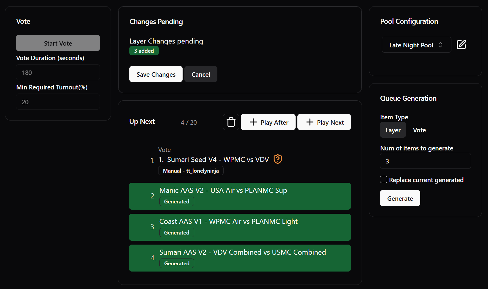

!!! important
    Remember to hit `Save Changes`

# Filters

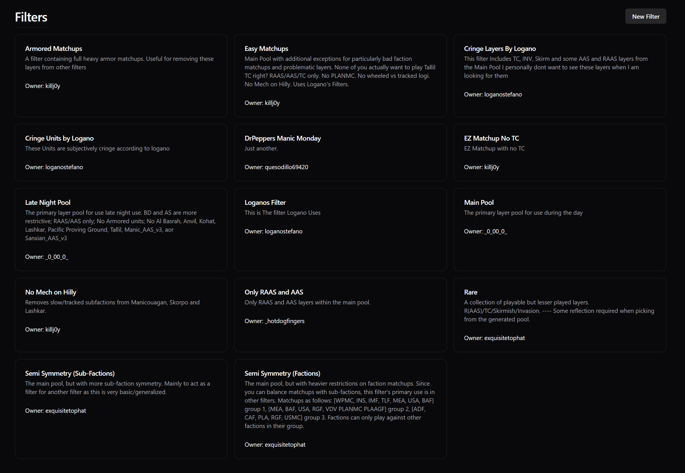

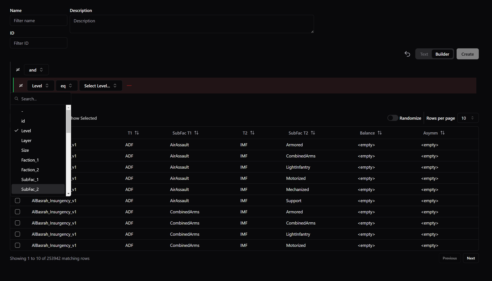

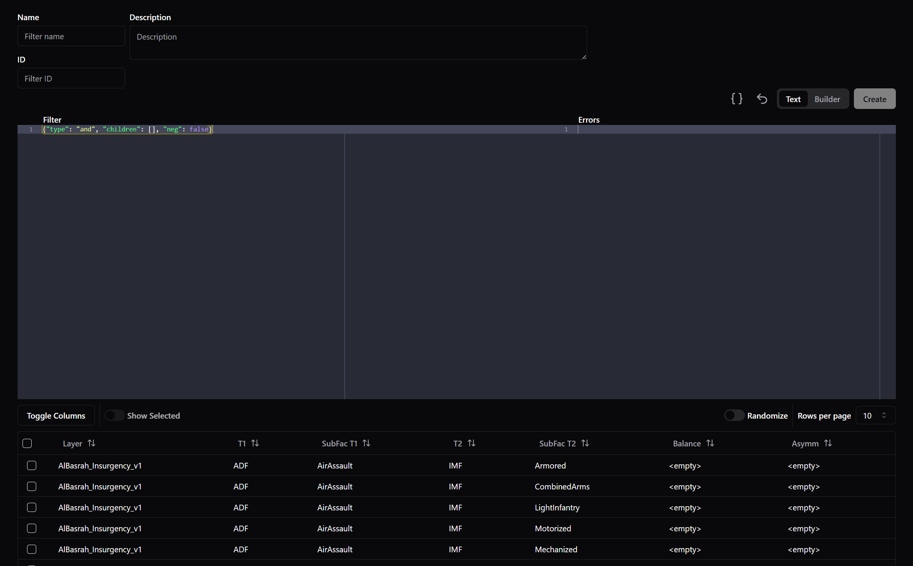

