# BattleMetrics

Battlemetrics(BM) is the out of game, web based program we use to do 90% of our administration on the server. It is a very broad-functioning program that has a lot of data and abilities available, mostly related to poking around and learning where stuff is and how to use it. To start using it and get linked up with the TT server, the first step is setting up a personal account and messaging the BM lead or another member of command the email used to register the BM account.

## BM Registration

1. Try to avoid using steam login and make an account with an email you have access to. It doesn’t ask for anymore personal info and people have had issues with steam login.
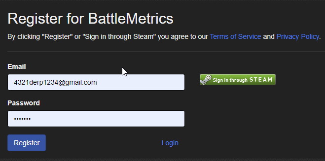
1. Verify your email after making the account by going to profile settings and sending verification email.
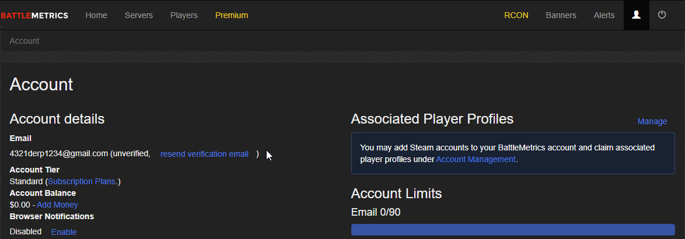
1. Confirm verification through your email.
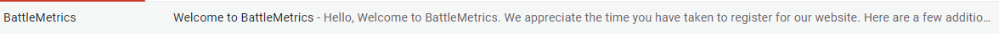

## BM Invite

Once that is done, you will need to send your email to the BM lead or a member of command so that they can invite you. 

1. You will receive an email invite to the TacTrig organisation and our servers.  
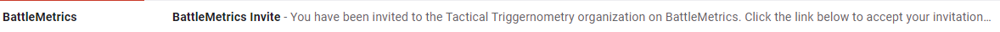
1. By clicking on the link in the email you will be sent to BM to finish your account setup. 
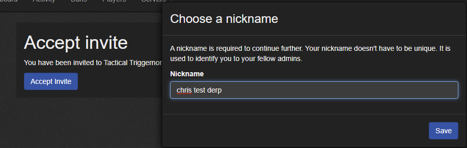
1. From the BM homescreen you should have access to the home dashboard by clicking on the RCON tab.  
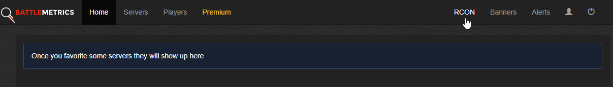
1. The home dashboard for TT admins should look like the below image [todo - image]. If it doesn’t or you aren’t able to successfully get to that point please reach out to the BM lead for troubleshooting assistance.
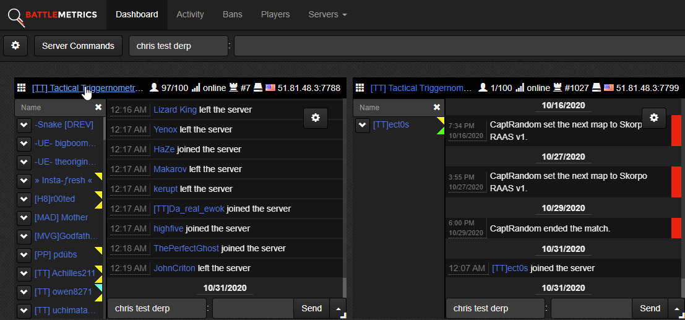

## BM Functions

Through the dashboard you can see the full options for each server by clicking on its name. You will be directed to the Player/chat main page.

Player/chat main page
> This is the default page where you can access the BM’s basic admin functionality and where you will spend 90% of your time. It's primarily made up of the chat/BM admin logs, list of player, server commands drop down and player commands drop down. 

Server commands drop down
> The menu across the top has drop down options that allow you to change the map, set the next map, show squads aWDSSnd many other less/not to be used commands.
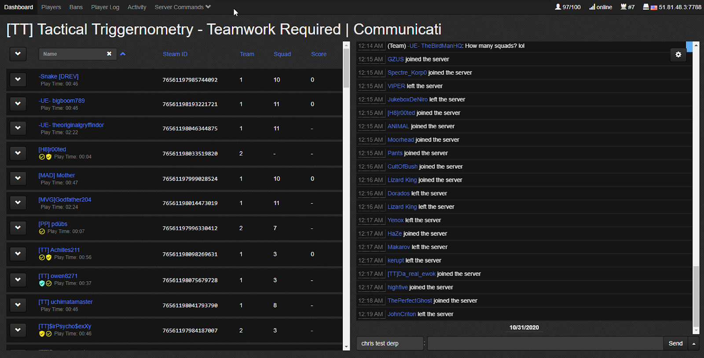
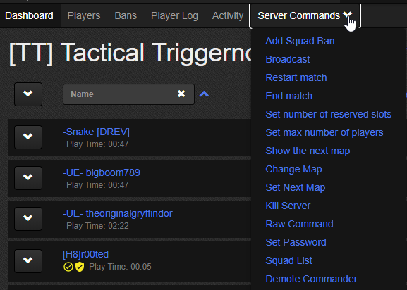

Squad list shows squads from both teams in a long scrolling pop up. Here you can check squad names, if they are locked, disband entire squads or remove individuals. You can exit this popup by clicking off to the side.
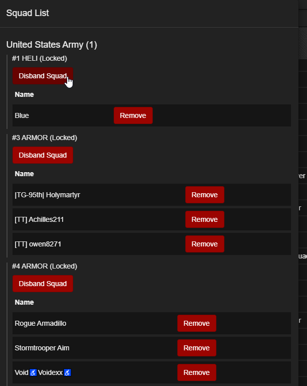

Player commands drop down
> By clicking on the drop down arrow beside each player’s name, a menu appears with specific player admin commands to be used on that player(If you want to ban, use add ban not add squad ban), you can also click on their name and go to their BM profile

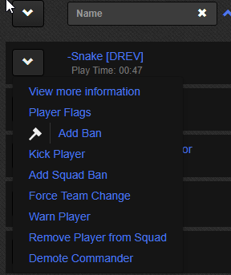

BM player profile 
> Each player has a BM profile page that is accessed through the drop down menu or clicking on their names. It has a link to their steam profile, total playtime on the server, all chat logs from that player, all admin actions against that player and much more info on that player. It also includes notes that can be attached to the profile and shared across all TT admin.

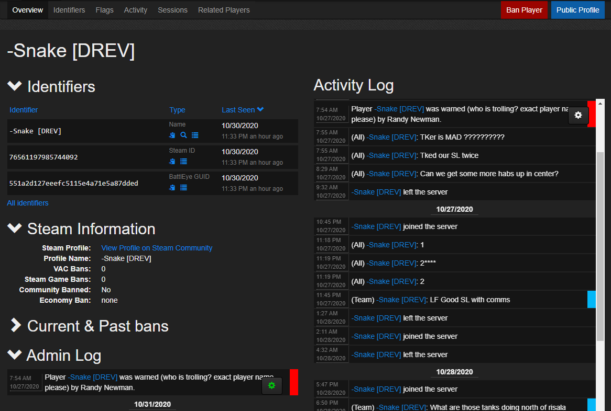

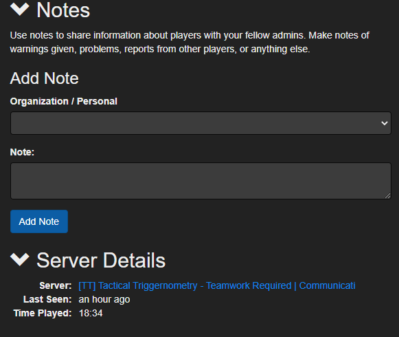

Add Ban
> When adding a ban, it is important to understand our structure of approximate ban lengths for certain offences and to clearly state in the ban reason what rule was being broken, or what led to the ban being issued. No one other than relations has the capability to add bans over 30 days, if someone is deserving of a longer ban simply post in problem payers their name, what happened and why they need an increased ban length. Relations will add the ban.
> 
> When inputting the ban, you only need to change the preset times from the drop down and replace “INSERT REASON HERE” with what the ban is for. Leave the rest of the templated line alone and you can see what the player will see below in the preview space. Add notes if you feel the situation requires it.

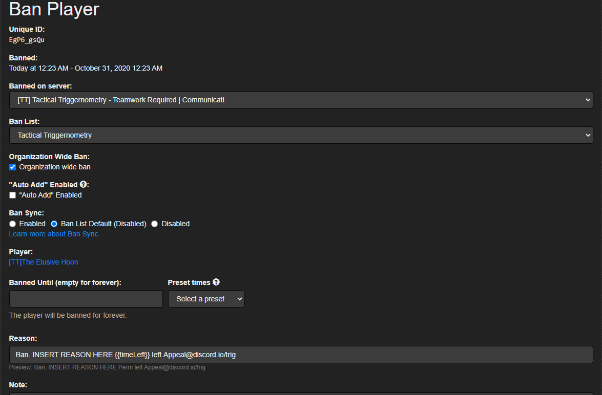