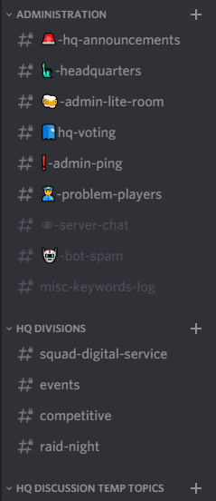
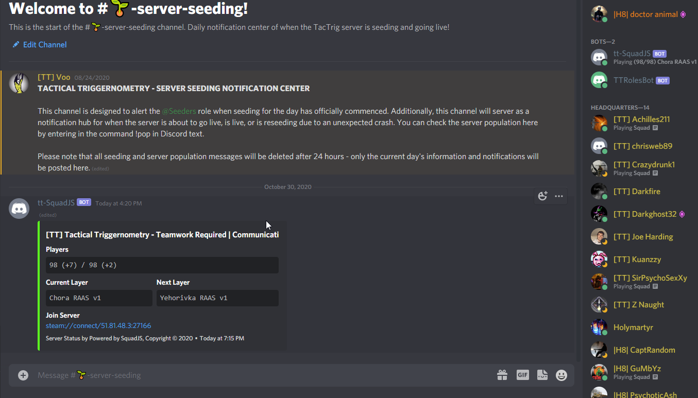

# Discord

Discord is massively important to us as a community for interaction, out-of-game talking, and dealing with any issues. As an admin, you will gain access to private channels that we use to discuss player issues, server issues, and anything else that could hinder or bolster our community. Because of this it is **SUPER** important for admins of all types to remain active in the administration section of discord. You can mute or ignore the general public channels as you wish, but you should do your best to pay attention and keep up to date on the things happening in the administration channels. There are also the shared space channels of Contact HQ and Jail and Courthouse.

Discord abilities: As a member of the admin team you will have higher discord permissions and the abilities to:

* give/take roles of those below you
* delete messages 
* move people in voice channels 
* kick/ban players from the server.

These abilities should be reserved in use until you have a better understanding of things and on a need to do basis. Reach out for guidance in this topic.

`Contact HQ` is a channel for the public to post any issues they are having on the server whether it is other players, server performance, or general feedback. Attempt to help where you can; if it's out of your lane, wait for someone else or get a member of `@relations`, `@SDS` or `@Command` as required.

`Jail and Courthouse` is a channel for the public to post ban appeals or further dig into admin actions against them. This can be a dangerous channel as it's the number one hot bed for drama. `@relations` are the experts and managers of this channel, and should be sought if any other than the most basic issues arise. Keep additional comments and conversations out of the J&C.  Only a single admin or relations team member should engage.  Use our private `problem players` channel to communicate your thoughts. J&C etiquette can be found [here](http://tiny.cc/TTJ-CEtiquette).

The remaining channels to worry about are all internal to HQ and are relatively self explanatory in use. They are structured to organise and spread out conversations to keep things focused. 

The `server chat` channel has the same chat as seen in BM, except it includes TKs and admin broadcasts.

# Server Status & Seeding

In the server seeding channel, there is an auto updated message that shows the server  pop, current map and next map. This message is persistent and doesn’t need interaction to function. You can also find the server pop by looking at the tt-SquadJS Bot or typing `!server` in any channel (this message doesn’t update)

The server has set population, time and map parameters that automatically put it in seeding mode. This sends out seeding reminders ingame for all players, and posts a seeding message in Discord. The channel auto-clears itself when the server is live. Admins are still able to post in the channel to call for seeders and give any server updates.

The seeder role was (and still is) assigned manually by HQ.  We now have a bot that will assign the role to anyone that responds to the seeding emoji on the first post.  They can unreact to remove the role if they wish. We need to advertise this function as much as possible and have people sign up for the role that are able to help

# Discord Command Reference

* `/whitelist add <id64>`
* `/whitelist show <id64>`
* `/whitelist remove <id64>`
