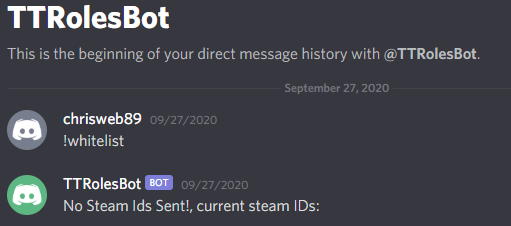
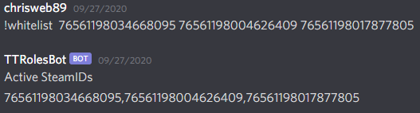
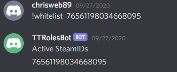

# TTRolesBot

Once you are given an admin role in discord the first step is to get your steamid linked with the server so that it recognizes you as an admin. This will give you abilities to use in-game console commands and give you a reserved spot. This is the same system used to link patrons to their reserved spots. The bot is fully automated and self updates the server, any steamid changes should be active on the server next map change, there is a possibility it will take a couple of hours, any longer that and reach out for tech support/confirm steps.

Steps: 

1. Send the @TTRolesbot the message `!admin STEAMIDHERE` after giving the user the Admin Lite discord role. This command allows you to check current steam ids attached to your user by sending “!whitelist” alone or add new steam ids by sending !whitelist and including a list of steam ids after it.

1. Find your steam id here https://steamid.io/, we need your steam64, nothing else will work.
1. To set up your solo steamid as an admin use the following, `!whitelist <your steamid here>`.  
1. It should send back a confirmation that looks like this. 

1. If you have a patreon subscription and are entitled secondary reserved spts for steam ids, list them after your steam id in the same message. It should look like this `!whitelist <your steamid>, <friend’s steamid>`.  
1. The bot again will send back a confirmation, it is VERY important that the admin sends their steamid first, as that is the one that will receive the powers.

# Admin-Lite Onboarding Checklist

This checklist has been designed to be completed in order. 

- [ ] Add information to the roster ([Admin Roster 2.0](https://docs.google.com/spreadsheets/d/1E9sNXuz5dKnurTKuMM9iAG1WODAKzoZbjn4nen8ZlUw/edit#gid=0))
- [ ] Onboarder (HQ) only! Update flags in battlemetrics and update discord permissions
    - [ ] Contact CMD with lite’s email for google drive
- [ ] Onboardee (new Lite) only! Direct message the TTRolesBot “!admin {YOURSTEAMID}”.  As with whitelist, the server will give you your new powers after the next map roll. http://tt-roles.tacticaltriggernometry.com/profile
- [ ] Onboardee (new Lite), open the email from battlemetrics and accept the invitation to the battlemetrics organization. 
- [ ] View and consider the [TT Admin Info/Policies](../policies/all_admins.md)
- [ ] View and consider the [Admin Lite Info/Policies](../policies/admin_lite.md)
- [ ] Talk about expectations in reference to the two prior reviewed documents:
    - [ ] Player versus administrator responsibilities
    - [ ] General responsibilities
    - [ ] Professionalism
- [ ] Review of the [Tactical Triggernometry Squad Server Rules](../server/server_rules.md)
- [ ] Learn to use your new tools
    - [Admin Reference Sheet](./command_reference.md)
    - [Rules Enforcement](../guides/rules_enforcement.md)
    - Admin Cam: `Left Shift + P`
- [ ] Helpful Resources:
    - https://squadmaps.com/
    - The current layers map (Find [here](../index.md))
- [ ] Test your new tools before you get out there
    - [ ] Warn your onboarder	
    - [ ] Kick your onboarder (use “admin onboarding test” as kick reason)
    - [ ] Examine what a ban process looks like

Go have fun! Congrats!

