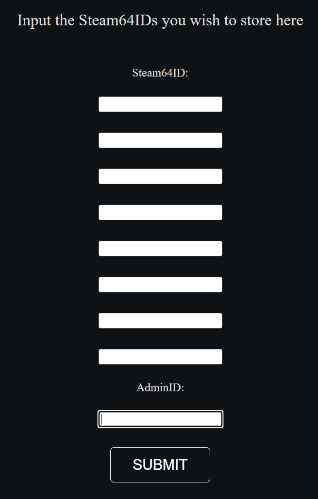
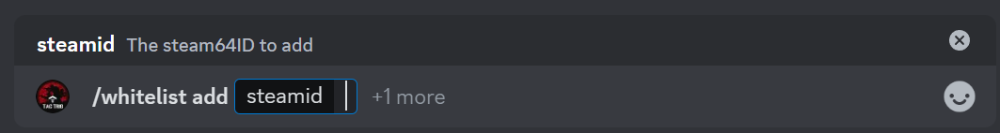

# Whitelisting

Whitelisting is the process in which players can sign up to avoid waiting in long queues on TT.  The result is that any player with whitelist, when joining the TT queue, will be put in line in front of non-whitelisted players, but behind those whitelisted players already in the queue.

Players can request whitelist in the `#request-whitelist` channel on Discord.  

!!! note:
    Who decides who gets whitelist?  What are the criteria we tend to appreciate other than SLing and seeding?

Once somebody is allowed access to the whitelist, an admin can add them in one of two ways:
* Via the * [TT Roles](http://tt-roles.tacticaltriggernometry.com/profile) page
* Via the `@TTRolesBot`bot on Discord.

## Adding via the Web page

* Click the [TT Roles link](http://tt-roles.tacticaltriggernometry.com/profile)
* Login with Discord (make sure it's you and click `Authorize`)
* Enter the Steam64ID for the user in the list, and make sure your admin's Steam64ID is entered at the bottom (it should be auto-filled for admin users)

## Adding via Discord

Adding via Discord is also relatively easy. 
* Look up the user's Steam64ID at https://steamid.io/ (make sure it's the 64 version!)
* In Discord, issue the command `/whitelist add <steamid64>`

